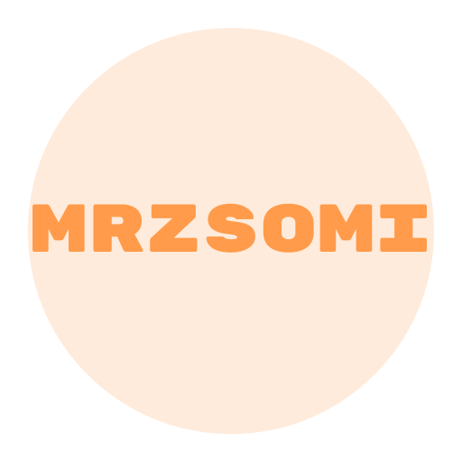

# 🌐 mrzsomi.top — Personal website / Portfólió

[English ⇢](#english) • [Magyar ⇢](#magyar)

---

  

---

## English

### Overview
A single-author personal website and portfolio for mrzsomi — https://mrzsomi.top. This repository contains the static source used to publish the site (HTML, CSS, JS, assets).

### Quick facts
- Author: mrzsomi
- Tech: HTML, CSS, Vanilla JavaScript
- Purpose: Personal portfolio and main web presence
- Status: Single-author — not open for external contributions

### Highlights
- Responsive hero with subtle animations
- Project showcase with multiple link types (GitHub, website, docs, live demo)
- Live GitHub activity feed (public events)
- Dark / Light themes and reduced-motion support
- EN / HU bilingual content

### Links
- Website: https://mrzsomi.top
- GitHub: https://github.com/SajtosZsomle
- Projects (EN): https://mrzsomi.top/projects.en.json

---

## Magyar

### Áttekintés
A mrzsomi személyes weboldala és portfóliója — https://mrzsomi.top. Ez a repository tartalmazza a statikus forrást (HTML, CSS, JS, képek), amiből az oldal készül.

### Gyors infók
- Szerző: mrzsomi
- Technológia: HTML, CSS, natív JavaScript
- Cél: személyes portfólió, fő webes megjelenés
- Állapot: egy szerző által karbantartott projekt — nem nyitott külső közreműködésre

### Főbb elemek
- Reszponzív hero animációkkal
- Projektek bemutatása több link-típussal (GitHub, web, dokumentáció, live demo)
- Élő GitHub aktivitás feed (publikus események)
- Sötét / világos téma, reduced-motion támogatás
- Angol és magyar tartalom

### Linkek
- Weboldal: https://mrzsomi.top
- GitHub: https://github.com/SajtosZsomle
- Projektek (HU): https://mrzsomi.top/projects.hu.json

---

Made with ❤️ by <strong>mrzsomi</strong> — © 2026

